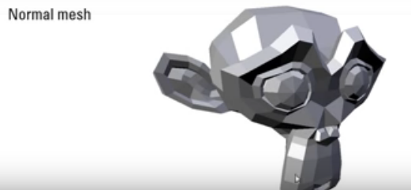
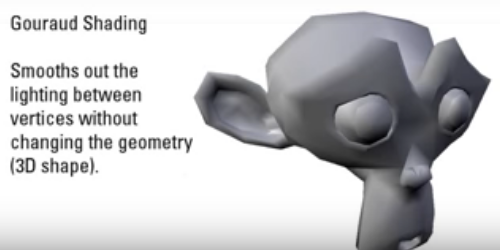
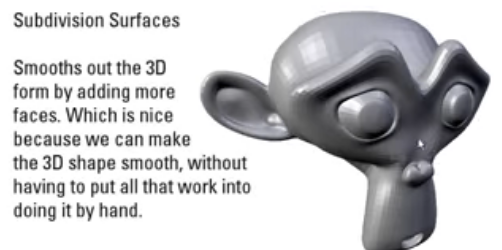
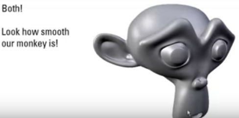
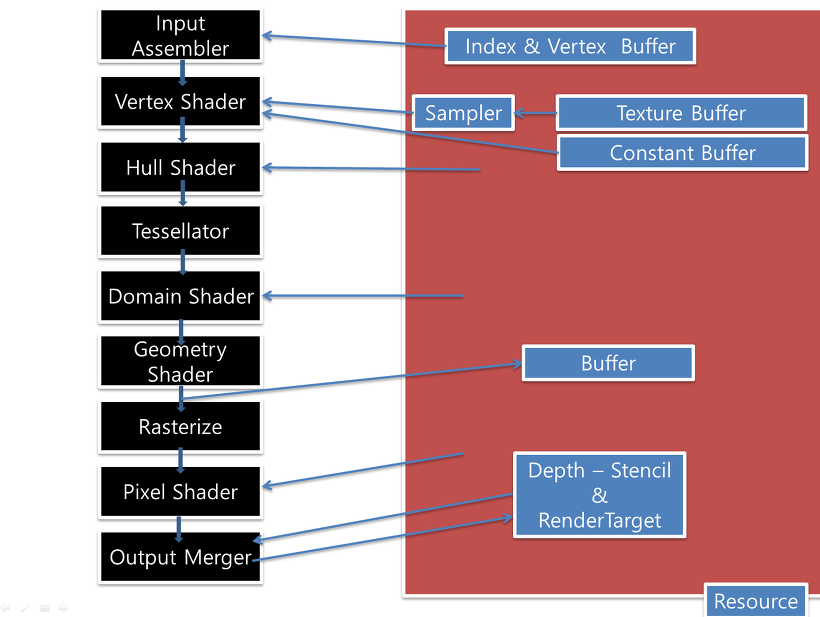

# Concepts

## Mesh

* The actual 3D data that defines the form.
* Meshes are hollow.

### Vertices / Edge / Faces

* Face count: Numbers of trinangles in mesh

### Vertices (Vertex)

* Corner of a shape.
* 3d shapes are made by triangles, arranged in a mesh. Each of which is described by 3 vertices.

### Smoothing a Mesh

## Texture

* A matrix of data elements. Typically used for images where each elemnet in the texture stores the color of a pixel and it is used to paint on top of the model.
* A texture stores texel information.

## Swap Chain

* To provide glitch-free playback, we have two frames. The front frame has the currently displayed content and the back frame is the next buffer ready drawing.
* A swap chain is a collection of buffers that are used for displaying frames to the user. Each time an application presents a new frame for display, the first buffer in the swap chain takes the place of the displayed buffer. This process is called swapping or flipping.

## Depth Buffer

* Depth Buffer is a texture that contains depth data about a pixel rather than color data.
* 0.0 for closest an object can be to the viewer.
* 1.0 for farest.
* There is a 1:1 mapping between the pixels in the back buffer and the depth info.
* Depth Stencil Buffer: Blocks specific pixel to the back buffer.

## Shaders

* Piece of code for transforming.
* A shader transforms one element at a time. So, for sake of performance, shaders execue at GPU.
* Two primitive types:
    * **Vertex Shader** transforms each vertex's 3d position in virtual space to the 2D coordinate at which it appears on the screen.
    * **Pixel Shader** transforms a texture's color to apply a lighting value or special effects such as blur, sepia-tone, edge enhancement and ...

## HLSL

* High Level Shader Language
* Shaders are typically written in HLSL, that is optimized for this work.
* In DirectX 3D two HLSL files are with the project (Texture and pixel shaders). These are compiled as parts of the project into the separated compiled shader object files (CSO), using the effect compiler (FxC.exe).

## Buffers

Buffers contain data that is used for describing geometry, indexing geometry information, and shader constants.

## Rendering Pipline

* **Resources** provide data to the pipeline and define what is rendered during your scene. Resources can be loaded from your game media or created dynamically at run time. Typically, resources include texture data, vertex data, and shader data. Most Direct3D applications create and destroy resources extensively throughout their lifespan.
* **Vertex Shader** consists of operations like transforming, skinning and lighting, ...
* **Rasterizer** prepares primitives for the pixel shader.
* **Output Merger** combines pixel shader values with contents of the render target and depth buffers to generate the final pipeline result.
