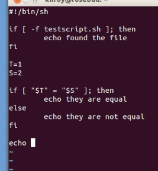
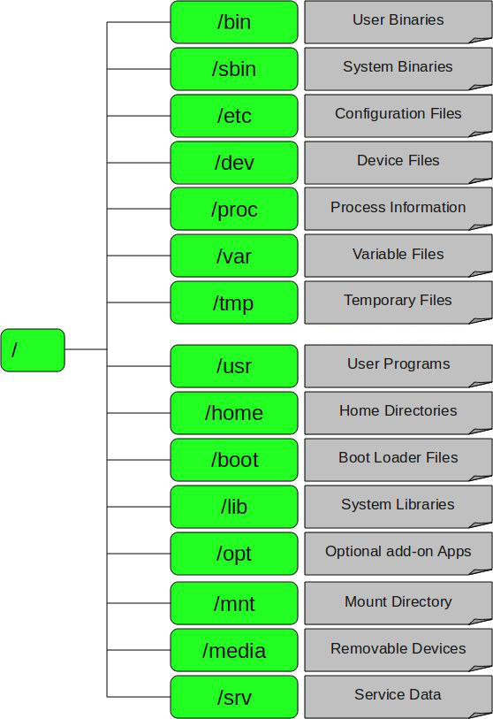
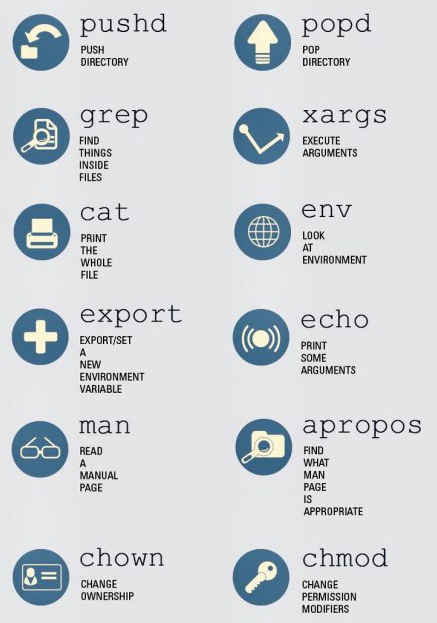

# Linux

* https://mh-salari.me/new-linux-essential/
* [Learn the ways of Linux](https://linuxjourney.com/)

## Bash = Bourne-again shell



* If you want to run them one after another: `procces1; process2; process3`
* If you want to run the next only if the previous succeeded: `process1 && process2 && process3`
* If you want to run them simultaneously: `process1&; process2&; process3&`

## Tmux

```bash
>> tmux new -s shahriar //new session by name
>> tmux ls //show all open tmux
>> tmux att //attach to last tmux
>> tmux att -t 1 //attach to tmux1
```

|Shortcut|Action|
|--|--|
|ctrl+b ➡ | to change pane
|ctrl+b ctrl+➡ | to resize pane
|ctrl+b z | zoom in/out
|ctrl+b c | to create new windows
|ctrl+b s | to see windows
|ctrl+b t | shows time
|ctrl+b % | Split ||
|ctrl+b " | Split -

## Dir



## Commands



|||
|--- |--- |
|Gcc file.c -o outputfileName|Compiling C program|
|sed 's/snow/rain/g' forests.txt|#find snow and replace it with rain (g for globally & s must always be there)|
|touch t.txt|#make txt file in dir|
|ls -alt|#ls with high details|
|cp a.txt b.txt|#copying|
|cp a.txt b.txt folder/|#copying a&b in folder dir|
|mv a.txt fld/|#moving|
|mv a.txt b.txt|#renaming|
|rm a.txt|#removing|
|rm -r fld/|#removing fld and childs inside|
|cat t.txt|#show content of file|
|cat t.txt > c.txt|#place t inside c|
|cat t.txt >> c.txt|#append t inside c|
|echo "Hello" >> c.txt Echo $var||
|wc t.txt|# number of lines, words, chars in file|
|cat t.txt | wc | cat > a.txt|# cat pipes to wc and then it'll pipe to cat then write on a.txt|
|sort a.txt|#sort content|
|uniq a.txt|#remove duplicate adjacent|
|sort a.txt | uniq|#remove all duplicates|
|grep -i abc t.txt|#search in file for abc regex (-i stands for incase sensitive) جستجوی عبارت در فایل مورد نظر|
|grep -R abc fld/|# search abc file and content in dir جستجوی عبارت در فایل های موجود در شاخه مورد نظر به صورت بازگشتی|
|grep -Rl abc fld/|# search only for file name|
|Nano t.txt|# nano text editor|
|source ~/.bash_profile|#activates the changes in file for the current session. Instead of closing the terminal.|
|Alias pd="pwd"||
|History|#history of entry commands|
|User="Shahriar"|#make $User variable|
|Export User="Shahriar"|#export makes the variable to be available to all child sessions initiated from the session you are in.|
|env|#command stands for "environment", and returns a list of the environment variables for the current user.|
|Uname -r|Name + 64bit /32bit|
|Dpkg -i a.deb|Depackageing|
|Chmod 755 xx.bin|Then ./xxx.bin|
|Python -m SimpleHTTPServer <port>|Starting Server on PWD|
|Nautilus .|Open pwd in Nautilus|
|Read var|Listen for input|
|Time ./program|Time to exec my program|
|Xdg-open <file>|Like double tap on file|
|Eog <pic file>|Image Viewer of gnome|
|tar czf file.tar.gz files tar czf file.gz files tar cjf file.tar.bz2 (c = compress , x=extract)|Make tar file Make tar.gz file Make tar.bz2 file|
|Curl [op][url] -o outname.f -O -v|#default name #view progress|
|W3m [url]|Browsing|
|rmmod -v pcspkr|Turing off Beeper driver|
|Man wget | less|Good for reading|
|Curl -n -d status="some text" http://twitter.com/statueses/update.xml|Posting status on twitter|
|Df -h|Shows Disk space usage|
|Du -h <dir>|Spaces usage of directory|
|locate filename|Find file by Name|
|find dir -name filename|یافت فایل مورد نظر ما در شاخه مورد نظر|
|updatedb|ساخت یا به روز رسانی دیتابیس فایل های سیستمی شاخه روت لینوکس|
|which filename|نمایش شاخه محتوی فایل مورد نظر|
|Date Cal|Shows Date-Time / Calendar|
|W|Show uptime & TTY info|
|Uname -a|OS info|
|Finger|Users info|
|cat /proc/cpuinfo|CPU info|
|cat /proc/meminfo|RAM info|
|Free|نمایش فضاهای خالی و استفاده شده حافظه رم و سواپ|
|Fs_usage <PID>|File usage of process|
|Lsof -p <pid>|List of open files|
|Heap <PID>|Shows Objects that App use in OS|
|Leaks <PID>|Shows leaked memory … Memory with no pointer|
|Sysdiagnose <PID>|Do above commends and save them in a Compressed file in Temp folder|
|Vmmap <PID>|Virtual Memory Map|

## Exec Python File without calling python

```py
#!/usr/bin/python2.7
import sys ...
chmod +x x.py #And then give X permission
```

## Env

```bash
env
env | grep \$USER

export PATH=$PATH:/newEnv/ #Add Env
```