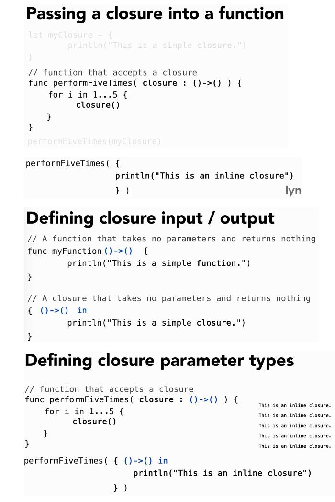

# Swift

* [awesome arkit](https://github.com/olucurious/Awesome-ARKit)

## Capture iOS Simulator video

In terminal: `xcrun simctl io booted recordVideo appVideo.mov`

## Closure

```swift
func foo( bar:()->String){
	print(bar())
}
foo({return "xx"})

func foo( bar:()->()){ bar() }
foo(()->() in print("xx"))
foo(print("xx"))
```



## Basics

```swift
// Casting
var i:Int?=Int("2")
var i =Int("2")
var s:String? = String(2.3)
var s = String(22)
var car1 = truck1 as Car

// String
let strformat= "hello \(name\),\(age\)"
let multiLineString = """ xxx
xxx """

// loop
for index in 1..10 {}

// do-while
repeat{} while true

// Array
var ar:Double = [1.1,2.3]
var ar:Any = [1.1,2.3, "Any", true]
var names = [String]()
names.append("Ali")
name.remove("Ali")
name.remove(at:1)
name.removeLast()
name.removeAtIndex(3)
var names2 = Array<String>()

// Sets
var names = Sets<String>()
names.insert("Ali")
names.insert("Ali")

// Dictionary
var dic:[Int:String]= [12:"Ali",22:""]
var dic= [12:"Ali",22:""]
var dic= [Int:String]()
dic[22]="Ali"  			// adding
dic[22]=nil				// removing
dic.removeValueForKey(22) // removing
for (key, val) in dic{} // loop
dic.updateValue("XX",forKey:22)

// func
func foo(){} // === func foo()->(){}
func sum(n1: Double, n2:Double) -> Double { return 0}

func sum(a n1: Double, b n2:Double) -> Double { return 0}
sum(a:2.0,b:1.0)

// Access Level
let x =1  // internal
public let x=2
private let x=3
```

### Tuple

```swift
func x() -> (n1: Double, n2:Double) { return (0,1)}
x().n1
x().0
let (m1,m2) = x()
```

### class

```swift
class Car{
	var type:String?
	var price:Double?
	init(type:String){
		self.type=type
	}
	func getType()->String{
		return "A"
	}
}
var car1 = Car(type:"X")
car1.type="S"

// inheritance
class Truck:Car{
	override func getType()->String{
		return super.getType() + "Z" //AZ
	}
	override init(){ super.init("AZ") }
	private func foo(){}
}

// Interface - Protocol
protocol ILayer{
	func x(z:Int) - Int
}
```

### Extension

```swift
extension Car{
	func getPrice()->Int{
		return prise
	}
}
extension Double { func foo() {print(self)} }
```

### Enum

```swift
enum Direction { 
	case EAST
	case WEST
}
let xxx: Direction
xxx = .EAST
switch xxx{
	case .EAST:
		print()
}
```
