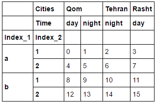
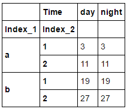
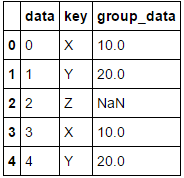
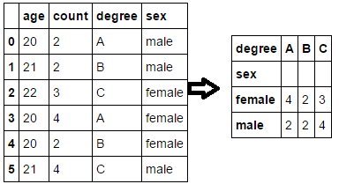

# Pandas

```py
import pandas as pd from pandas import Series, DataFrame from pandas import Series, DataFrame

Series (data=None, index=None, dtype=None, name=None, copy=False, fastpath=False)

obj.values
obj.index
ser1.sort_index()
ser1.sort_values()
rainDrop.to_dict()
Series(rainDrop_dict)
pd.isnull(obj) #Series of Booleans
pd.read_clipboard() #Paste from Clipboard
rainDrop.name = "Rain Drops of Cities"
rainDrop.index.name = "Cities"
.Round
.ix[3]
```

- Reshaping/Resizing

A numpy array can be reshaped and resized.
Reshaping with np.reshape returns a new array with a modified shape and resizing with np.resize modifies the original array.
A third function np.ravel returns a flattened array.

```py
dframe2 = DataFrame(np.arange(16).reshape(4, 4)
    , index = [['a', 'a', 'b', 'b'], [1, 2, 1, 2]]
    , columns = [['Qom', 'Qom', 'Tehran', 'Rasht']
    , ['day', 'night', 'night', 'day']]) 
dframe2.index.names = ['Index_1', 'Index_2'] dframe2.columns.names = ['Cities', 'Time']
```



```py
|dframe2.swaplevel('Cities', 'Time', axis = 1)
```


```py
|dframe2.sum(level = 'Time', axis = 1)
```



```py
pd.merge(dframe1, dframe2)
pd.merge(dframe1, dframe2, on = ['key1', 'key2'], how = 'inner') /left/right/outer #Like JOIN in SQL must have same thing in a column
pd.merge(df_left, df_right, on = 'key1', suffixes= ['_lefty', '_righty']) #Add suffixes to end of columns which are not key1
```

```py
pd.merge(dframe_left, dframe_right, left_on = 'key', right_index = True)
```


```py
dframe_left.join(dframe_right, on='key')
```



```py
df1.pivot('sex', 'degree', 'count')
```



|                                                                                                                                                                                                  |                                                                                                                                |
| ------------------------------------------------------------------------------------------------------------------------------------------------------------------------------------------------ | ------------------------------------------------------------------------------------------------------------------------------ |
| IN: 'Semnan' in rainDrop OUT: True                                                                                                                                                               | Is 'semnan' in raindrop indexes                                                                                                |
| .reindex(['A', 'B', 'D', 'Z'], fill_value = 0)                                                                                                                                                   |                                                                                                                                |
| .reindex(range(11), method = 'ffill')  #forward filling                                                                                                                                          | 0    Tehran 3    Tabriz 6    Shiraz v----v-----v 0     Tehran 1     Tehran 2     Tehran 3     Tabriz 4     Tabriz 5     Tabriz |
| .reindex(range(11), method = 'bfill')                                                                                                                                                            | 0     Tehran 1     Tabriz 2     Tabriz 3     Tabriz                                                                            |
| .reindex(columns = ['col4', 'col1', 'col7'])                                                                                                                                                     | (Not renaming) new DF with those columns                                                                                       |
| .ix[['A', 'B', 'Z'], ['col1', 'col3', 'col8']]                                                                                                                                                   |                                                                                                                                |
| .drop('A') .drop('col1', axis = 1)                                                                                                                                                               |                                                                                                                                |
| .rank()                                                                                                                                                                                          | Base on value of item in series will return index of a sort one                                                                |
| dframe1.idxmin()                                                                                                                                                                                 | index of minimum value                                                                                                         |
| .cumsum() .cumsum(axis = 1)                                                                                                                                                                      | cumulative summation                                                                                                           |
| .describe()                                                                                                                                                                                      | Min/max/std/mean… all together                                                                                                 |
| data.isnull()                                                                                                                                                                                    | Return Boolean series                                                                                                          |
| data.dropna()                                                                                                                                                                                    | Remove N/A (null)                                                                                                              |
| dframe2.dropna(thresh=2)                                                                                                                                                                         | keep the rows with at least 2 non-null values                                                                                  |
| dframe2.fillna({'A':0, 'B':1, 'C':2, 'D':3})                                                                                                                                                     | fill missing values of each column differently keys of the dictionary are columns and values are for filling missing values    |
| dframe2.fillna(dframe2.mean())                                                                                                                                                                   | fill missing value of each column by mean value of that column                                                                 |
| Series(randn(6),  index = [[1, 1, 1, 2, 2, 2], ['a', 'b', 'c', 'a', 'b', 'c']])                                                                                                                  | Multi index                                                                                                                    |
| df= pd.read_table("testData.csv", sep=',', header = None, nrows = 2) df.columns = ["Age", "Toefl", "Degree", "UniRank"]                                                                          | Open CSV (nrows only shows 2 row)                                                                                              |
| dframe.to_csv(sys.stdout, sep = "-", columns = ["Age", "Degree"])                                                                                                                                | Save CSV                                                                                                                       |
| import codecs dframe = pd.read_json(codecs.open('x.json', 'r', 'utf-8')) dframe.head(n = 1)                                                                                                      | Open Json utf8                                                                                                                 |
| pd.io.html.read_html(url)                                                                                                                                                                        | From Html                                                                                                                      |
| dframe1 = DataFrame({"key": list("XZYZXX"), "data_set_1": np.arange(6)})                                                                                                                         | Multi columns DF                                                                                                               |
| arr1 = np.arange(9).reshape(3, 3) NUMPY.concatenate([arr1, arr1], axis = 0)                                                                                                                      | array([[0, 1, 2],[3, 4, 5],[6, 7, 8],        [0, 1, 2],[3, 4, 5],[6, 7, 8]])                                                   |
| np.concatenate([arr1, arr1], axis = 1)                                                                                                                                                           | array([[0, 1, 2, 0, 1, 2],        [3, 4, 5, 3, 4, 5],        [6, 7, 8, 6, 7, 8]])                                              |
| pandas.concat([ser1, ser2]) pd.concat([dframe1, dframe2])                                                                                                                                        | T    0 U    1                                                                                                                  |
| Series(np.where(pd.isnull(ser1), ser2, ser1), index = ser1.index)  ser1.combine_first(ser2)  np.where(pd.isnull(ser1), ser2, ser1)                                                               | make a series based on series1 while using series2 to replace its null values.                                                 |
| dframe_odds.combine_first(dframe_evens)                                                                                                                                                          | make a data frame based on dframe1 while using dframe2 to replace its null values.                                             |
| dframe1.stack()/.unstack(level='city')  .stack(dropna=False)                                                                                                                                     | Data Frame to Series #The null values will be ignored automatically                                                            |
| DataFrame.pivot(index=None, columns=None, values=None)                                                                                                                                           | Reshape data based on column values                                                                                            |
| df2.pivot_table(index = 'sex', columns='degree')#, aggfunc=np.sum)                                                                                                                               | Use pivot_table if there are duplicates records                                                                                |
| dframe.duplicated()                                                                                                                                                                              | Series of Boolean if row contains duplicates                                                                                   |
| dframe.drop_duplicates(['key1'], keep='last')                                                                                                                                                    |                                                                                                                                |
| state_map = {"Rasht": "Gilan", "Tehran": "Tehran", "Bam": "Kerman"} dframe['state'] = dframe['city'].map(state_map)                                                                              | Add new a column to DF with Dict                                                                                               |
| ser1.replace([1,3], [100, 300])  ser1.replace({1:np.nan, 2:200})                                                                                                                                 |                                                                                                                                |
| dframe.index.map(str.upper)                                                                                                                                                                      | def myMap(input):     return input + ",,," dframe.columns.map(myMap)                                                           |
| dframe.rename(index = str.title, columns = myMap, inplace=True)                                                                                                                                  |                                                                                                                                |
| decade_cats = pd.cut(years, myBins)                                                                                                                                                              | Return List of Categories which years are in it base on myBins                                                                 |
| pd.cut(years, bins=2, labels=['First half', 'Second half'])                                                                                                                                      | Split in to half                                                                                                               |
| dframe.head(n=3)  dframe.tail()                                                                                                                                                                  | Print part of a DF                                                                                                             |
| blender = np.random.permutation(4)                                                                                                                                                               | Random Jaygasht of 0 To 4                                                                                                      |
| Df.take(blender) arr.take(blender)                                                                                                                                                               | Shuffle DF or array base on blender permutation                                                                                |
| group1 = dframe['dataset1'].groupby(dframe['k1'])                                                                                                                                                | Return <pandas.core.groupby.SeriesGroupBy object>                                                                              |
| arr1 = np.array(['Qom', 'Bam', 'Qom', 'Bam', 'Qom']) dframe['dataset1'].groupby(arr1).mean()                                                                                                     | Dframe doesn’t have Bam and Qom but will assign them to 5 records of his and will make a group with Qom and Bam                |
|                                                                                                                                                                                                  |                                                                                                                                |
| animals.ix[[1, 3], ['W', 'Y']] = np.nan                                                                                                                                                          |                                                                                                                                |
| df['engExamResult']=df['engExamResult'].apply(pd.to_numeric, errors='coerce')                                                                                                                    | Casting                                                                                                                        |
| with pd.option_context('display.max_rows', None, 'display.max_columns', 3):     print(df) --------------- pd.set_option('display.max_rows', len(x)) print(x) pd.reset_option('display.max_rows') | (pretty) print the entire Pandas Series                                                                                        |
| df.ix[:, df.columns != 'b']                                                                                                                                                                      | get all column except one                                                                                                      |
