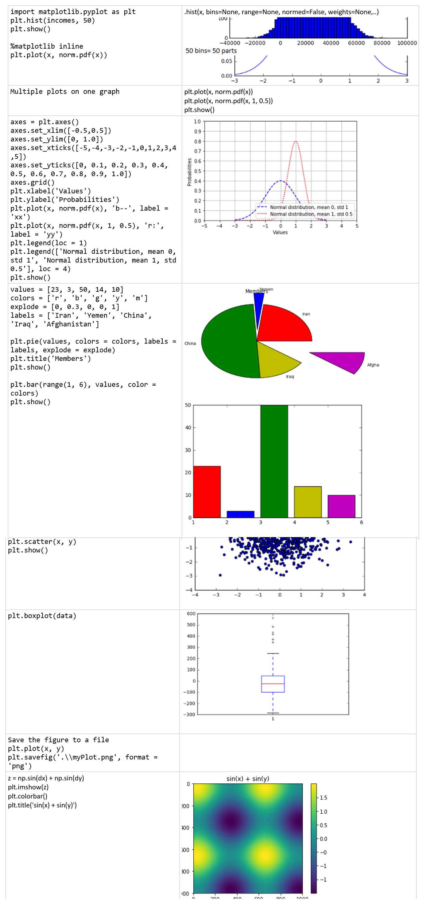

# Visualization

## Tools

- `matplotlib`
- `seaborn`
- `mpld3` provides alternative renderer (using d3) for matplotlib code. Quite nice, though incomplete.
- `bokeh` is a better option for building interactive plots.
- `plot.ly` can generate nice plots – this used to be a paid service only but was recently open sourced.
- `Altair` is a relatively new declarative visualization library for Python. It’s easy to use and makes great looking plots, however the ability to customize those plots is not nearly as powerful as in Matplotlib.

## Matplotlib

matplotlib (the de-facto standard), activated with

- `%matplotlib inline` – Here’s a Dataquest Matplotlib Tutorial.
- `%matplotlib notebook` provides interactivity but can be a little slow, since rendering is done server-side.

From <https://www.dataquest.io/blog/jupyter-notebook-tips-tricks-shortcuts/>

## Seaborn

- Seaborn is another module for creating diagrams. As with pandas, matplotlib is used in the background, i.e. many settings can be made via matplotlib and used for the actual graphic Seaborn.
- Seaborn is built over Matplotlib and makes building more attractive plots easier. Just by importing Seaborn, your matplotlib plots are made ‘prettier’ without any code modification.

```py
import seaborn as sns
m = pd.read_csv("/data/measurements.csv", sep=";",na_values="-")
sns.set(style='darkgrid') # whitegrid
g = sns.catplot(data = m, x = "size", y = "ram", hue="type", palette=["#009bcc","#ff8200","#9bba00"])
g.set(ylim=(0, 10000))
plt.show()

citieslocs = cities.join(locs, rsuffix="Stadtc") sns.relplot(x="Lon" ,y="Lat", data = citieslocs, hue="Landkreis", size="Einwohner",sizes=(200,500))
```

## Plot


