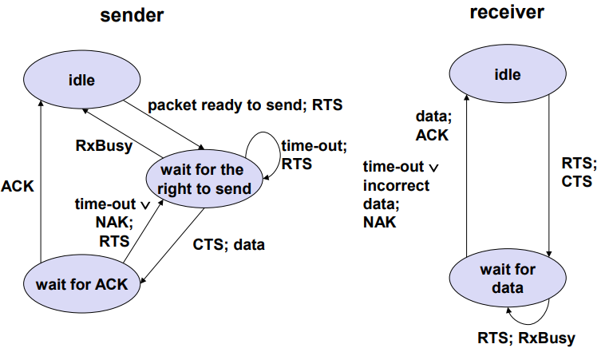
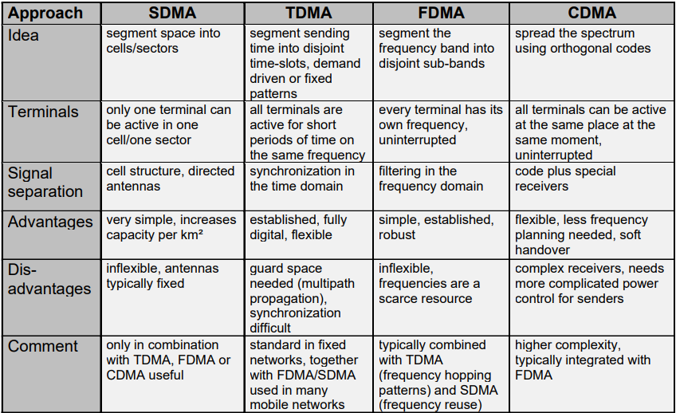

# Advance Mobile Communications Networks

https://www.youtube.com/results?search_query=Mobile+Communications+Networks&sp=EgIQAw%253D%253D

* Core ICS Research Areas
    * LTE and 5G
        * Repair of broken base stations and coverage holes
        * Handle spatial overload
        * Save energy
    * Communicating Unmanned Aerial Vehicles (UAVs)
    * Cognitive radio networks
        * Cognition of radio situation
        * Flexible use of unused frequencies
        * Implementation on software-defined radios

## IP protocol model - OSI protocol

* Difference between function and service of a protocol?
    * Protocol is the special set of rules that end points in a telecommunication connection use when they communicate. In other words Protocol is an agreed-upon format for transmitting data between two devices. The protocol determines the following: 
        * the type of error checking to be used
        * data compression method
        * if any how the sending device will indicate that it has finished sending a message
        * how the receiving device will indicate that it has received a message
    * Service is a program, routine, or process that performs a specific system function to support other programs, particularly at a low (close to the hardware) level

* Which protocol layers provide end to end, which hop to hop services? `TCP e2e / UDP h2h`

    > WIKI: Hop-by-hop transport is a principle of controlling the flow of data in a network. With hop-by-hop transport, chunks of data are forwarded from node to node in a store-and-forward manner. As hop-by-hop transport involves not only the source and destination node, but rather some or all of the intermediate nodes as well, it allows data to be forwarded even if the path between source and destination is not permanently connected during communication. Hop-by-hop transport requires per-flow state information at intermediate nodes, which limits its scalability. This is one of the reasons why almost all communication today is controlled by end-to-end transport protocols such as TCP.

* Difference between transport protocol and logical link sublayer?
* Purpose of a TCP/UDP port, difference to IP address?
* What does VPN mean? Which protocol implements it?
* What does CSMA stand for? How does it work? `Carrier Sense Multiple Access with Collision Detection (IEEE 802.3)`
* What´s the purpose of IP subnetting? `More IP` What´s the effect on routing?

[src1 (overall)](https://www.studytonight.com/computer-networks/tcp-ip-reference-model) // [src2 (details)](http://www.pearsonitcertification.com/articles/article.aspx?p=1804869)

## Wireless Transmission (Layer 1)

* WLAN/WiFi/802.11 Systems
* IEEE 802.16/WiMAX Systems
* Unlicensed Mobile Access (UMA)
    Access to GSM and GPRS mobile services over unlicensed spectrum(WLAN, Bluetooth)
* Fixed Mobile Convergence (FMC)
    * SIP over Wi-Fi
    * Centralized Application Server or IP-PBX controls VoIP services
    * advanced VoIP services on mobile, enterprise, home, and public WiFi networks
* 4G Mobile Communication Systems
* 5G Mobile Communication Systems

## Medium Access Schemeses (Layer 2)

MAC in Multi-Channel Scenario

### Media Access

* The problem: multiple users compete for a common, shared resource
(medium)
* Can we apply media access methods from fixed networks?
Example: CSMA/CD
    * Carrier Sense Multiple Access with Collision Detection (IEEE 802.3)
    * send as soon as the medium is free (carrier sensing – CS)
    * listen to the medium, if a collision occurs stop transmission and jam
    (collision detection – CD)
* Motivation – hidden and exposed terminals
* Motivation – near and far terminals

#### Access methods SDMA/FDMA/TDMA

These multiplexing schemes are now used to control medium access!

* SDMA (Space Division Multiple Access)
    * segment space into sectors, use directed antennas
    * cell structure
* FDMA (Frequency Division Multiple Access)
    * assign a certain frequency to a transmission channel between a sender and a receiver
    * permanent (e.g., radio broadcast), slow hopping (e.g. GSM), fast hopping (FHSS, Frequency Hopping Spread Spectrum)
* TDMA (Time Division Multiple Access)
    * assign the fixed sending frequency to a transmission channel between a sender and a receiver for a certain amount of time

#### Communication link types

Each terminal needs an uplink and a downlink channel

Types

* Simplex
    * unidirectional link transmission
* Half Duplex
    * Bi-directional (but not simultaneous)
* Duplex
    * simultaneous bi-directional link transmission, two types:
        * Frequency division duplexing (FDD) **`FDMA`**
            * Separate frequency bands for upand downlink
            * (+) separation of uplink and downlink interference
            * (-) no support for asymmetric traffic
            * Examples: LTE, UMTS, GSM, IS-95, AMPS
        * Time division duplexing (TDD) **`TDMA`**
            * Separate frequency bands for upand downlink
            * (+) support for asymmetric traffic
            * (-) mix of uplink and downlink interference on single band
            * Examples: DECT, WLAN, UMTS (TDD), TD-LTE

### TDMA: Aloha/slotted aloha

random, distributed (no central arbiter), time-multiplex, Slotted Aloha additionally uses time-slots, sending must always start
at slot boundaries

### TDMA: Demand Assigned Multiple Access (DAMA)

* Channel efficiency only **18% for Aloha, 36% for Slotted Aloha**
* Reservation can increase efficiency to **80%**
* Idea: a sender reserves a future time-slot / sending within this reserved time-slot is possible without collision
* Disadvantage: reservation causes higher delays
* Applications:
    * typical scheme for satellite links (long round-trip-times)
    * application to packet data, e.g. in GPRS and UMTS
* Examples for reservation algorithms:
    * Explicit Reservation (Reservation-ALOHA)
    * Implicit Reservation (PRMA)
    * Reservation-TDMA

### TDMA: DAMA – Explicit Reservation based on Aloha

### TDMA: DAMA – Implicit Reservation

### TDMA: DAMA – Reservation-TDMA

### TDMA: Multiple Access with Collision Avoidance (MACA)

* Motivation: deal with hidden terminals without a base station (central controller)
* Idea: use short signaling packets for collision avoidance
    * RTS (request to send): a sender requests the right to send from a receiver with a short RTS packet before it sends a data packet
    * CTS (clear to send): the receiver grants the right to send as soon as it is ready to receive
    * all other stations listen to the signal
* Signaling packets contain
    * sender address
    * receiver address
    * packet size
* Collisions are mainly limited to the transmission of RTS signals which
is small compared to the data transmission
* Disadvantage: overhead where data packets are small

### TDMA: MACA variant: DFWMAC in IEEE 802.11

* ACK: positive acknowledgement
* NAK: negative acknowledgement
* RxBusy: receiver busy

### TDMA: Polling mechanisms

If one terminal can be heard by all others, this “central” terminal (e.g.
a base station) can poll all other terminals according to a certain
scheme

now all schemes known from fixed networks can be used (typical
mainframe - terminal scenario, round-robin, random, reservationbased)

Application to Bluetooth and 802.11 (possible access function)

### TDMA: ISMA (Inhibit Sense Multiple Access)

### CDMA access method  (Code Division Multiple Access)

### Summary

* central control of access to medium:
    * joint common view on resource situation simplifies coordination
    * but registration and/or static configuration of system needed
    * still need to coordinate the initial, random access of mobiles to the system
* decentralized control of access to medium:
    * disjoint & inconsistent views on shared medium (hidden & exposed terminal)
    * distributed arbitration scheme needed to minimize collisions
    * solution: RTS/CTS – to derive a joint common view on resource usage

## IEEE 802.11 (Layer 2)

file:///C:/Users/Master/Desktop/Advance%20Mobile%20Communications%20Networks/AMCN/AMCN-04-IEEE_802_11-2012-13.pdf

802.11: Architecture of an Infrastructure Network

802.11: Architecture of an Ad-hoc Network

## Mobility Management (Layer 3)

## TCP/IP

## Self-Organization

## Quality of Service

## Ad Hoc Networks

### Mobile Ad Hoc Networks (MANETs)

* Spontaneous federation of wireless devices
    * No infrastructure (base station / access point,no backbone
    * Devices can be mobile
* Packet-based forwarding
    * Each device must serve as a router
    * Routes between devices can span multiple hops
* Ad hoc networks are self organizing
    * No central components
* Advantages
    * Easy and cheap deployment
        * E.g. using 802.11 in license free ISM band (2.4 GHz)
    * Reduced transmission power
    * Robust to component failures
* Application: where there is no access to infrastructure
    * Military applications
        * Groups of soldiers, tanks, planes...
    * Civil applications
        * Conferences, exhibitions, meetings, lectures, gaming, …
    * Car-to-car-communication, network for taxis, police, …
        * Vehicular Ad Hoc NETworks (VANETs)
    * Extension of cellular networks
* Disaster recovery (Int. Graduate School on Mobile Communications)
    * After crash of infrastructure (e.g. telephone network after earthquake)
    * Rescue

## Cognitive Radio Networks

## Overview on cellular systems

---
# Cellular Communication Systems

## Review of Mobile communication basics

## Overview on GSM and GPRS

## UMTS architecture

(mobility management, connection and session management, wideband CDMA,
management of radio resources

## UMTS radio access network

## High-Speed Packet Access (HSPA)

## Long-Term Evolution (LTE)

## System Architecture Evolution (SAE)

## Self-organization in LTE