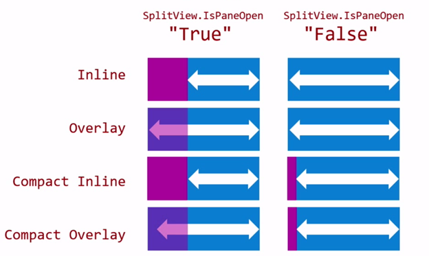

# UWP

* [create-custom-icon-fonts](https://medium.com/@Niels9001/create-custom-icon-fonts-and-use-them-in-your-uwp-app-1c518febbda1)
* [best-practices](https://github.com/futurice/windows-app-development-best-practices)

## Run on UI Thread

```c#
await Dispatcher.RunAsync(Windows.UI.Core.CoreDispatcherPriority.Normal, ()=> foo());
```

## Design Time Data

```xml
<ListView>
    <d:ListView.ItemsSource>
        <x:Array Type="{x:Type models:Item}">
            <models:Item Text="Hello"/>
            <models:Item Text="Hello2"/>
        </x:Array>
    </d:ListView.ItemsSource>
    <ListView.ItemsSource>
        <DataTemplate>
            <ViewCell>
                ...
            </ViewCell>
        </DataTemplate>
    </ListView.ItemsSource>
</ListView>
```

## Functions in x:Bind

* `<object property="{x:Bind pathToFunction.func(param, ...), bindingProperties}" ... />`
* https://docs.microsoft.com/en-us/windows/uwp/data-binding/function-bindings

```xml
<Grid Background="{x:Bind local:ColorEntry.Brushify(Color), Mode=OneWay}"
<!-- OR -->
<TextBlock x:Name="BigTextBlock" FontSize="20"/>
<TextBlock FontSize="{x:Bind local:ColorEntry.Half(BigTextBlock.FontSize)}" />
```

```c#
class ColorEntry
{
    public static SolidColorBrush Brushify(Color c) => new SolidColorBrush(c);
    public static double Half(double value) => value / 2.0;
```

### StringFormat

```xml
<Page xmlns:sys="using:System">
     <CalendarDatePicker Date="{x:Bind sys:DateTime.Parse(TextBlock1.Text)}" />
     <TextBlock Text="{x:Bind sys:String.Format('{0} is now available in {1}', local:MyPage.personName, local:MyPage.location)}" />
</Page>
```

### Message Dialog

``` cs
var dialog = new MessageDialog("Error. Noooo...");
dialog.Commands.Add(new UICommand("OK", OnOKButtonClicked));
dialog.Commands.Add(new UICommand("Cancel"));
await dialog.ShowAsync();
```

### VisualState

``` cs
//VisualState.GoToState(elementName,"IsClicked");
private void SizeChanged(object sender, RoutedEventArgs e){
    switch(UIViewSettings.GetForCurrentView().UserInteractionMode){
        case Userlnteractionmode. Mouse:
        VisualStateManager.GoToState(this, "MouseLayout", true);
        break;
        // When touch is returned, use touch-optimized layout
        case Userlnteractionmode. Touch: 
        default:
        Visual StateManager.GoToState(this, "TouchLayout" , true);
        break;
    }
}
```

### Set Image Source

`((Image) sender).Source = new BitmapImage(new Uri("ms-appx:///Assets/_film_.jpg"));`

### Save in clip

```cs
var pkg=new DataPackage();
pkg.SetText(res);
Clipboard.SetContent(pkg);
```

### Web Authentication

```cs
WebAuthenticationResult WebAuthenticationResult = await WebAuthenticationBroker.AuthenticateAsync(WebAuthenticationOptions.None, new Uri(loginUrl));
    if (WebAuthenticationResult.ResponseStatus == WebAuthenticationStatus.Success)
        var response = WebAuthenticationResult.ResponseData;
```

### HttpClient

```cs
HttpClient http = new System.Net.Http.HttpClient();
HttpResponseMessage response = await http.GetAsync("somesite");
var webresponse = await response.Content.ReadAsStringAsync();
```

### Rate & Review

`Windows.System.Launcher.launchUriAsync(new Windows.Foundation.Uri("ms-windows-store:review?PFN:" + Windows.ApplicationModel.Package.current.id));`

### Share

```cs
var manager = DataTransferManager.GetForCurrentView();
manager.DataRequested += (transferManager, args) =>
{
    var request = args.Request;
    request.Data.Properties.Title = "Msg";
    request.Data.Properties.Description ShareTextBox.Text;
    request.Data.SetText(ShareTextBox.Text);
};
DataTransferManager.ShowShareUI();
```

### Send Mail

```cs
var mail = new EmailMessage();
mail.To.Add(new EmailRecipient {Address="x@x.x"});
mail.Subject = "sub";
await EmailManager.ShowComposeNewEmailAsync(mail);
```

### Style

```cs
var s = new Style(typeof(Button));
s.Setters.Add(new Setter {Property = Button.BackgroundColorProperty, Value = Color.Red});
```

### Resource

```cs
<Grid Background="{ThemeResource ApplicationPageBackgroundThemeBrush}">
var cl=((SolidColorBrush)this.Resources["SystemControlBackgroundAccentBrush"]).Color;
```

### Open Dialog via ClassType

`await ((ContentDialog)Activator.CreateInstance(_typeOfTheClass)).ShowAsync();`

### PageReload

```cs
private void Reload(object param) {
    var type = Frame.CurrentSourcePageType;
    Frame.Navigate(type,param);
    Frame.BackStack.Remove(Frame.BackStack.Last());
}
```

### Splitview



## Animation

```xml
Starts with:
<Page.Transitions>
        <TransitionCollection>
            <NavigationThemeTransition>
               ##Animation Here <CommonNavigationTransitionInfo/>
            </NavigationThemeTransition>
        </TransitionCollection>
</Page.Transitions>
In <Navigation Theme Transition>:
CommonNavigationTransitionInfo/>	# WP7 Start Load Style
ContinuumNavigationTransitionInfo/>	# Win10 Start Load Style
DrillInNavigationTransitionInfo/>		
EntranceNavigationTransitionInfo/>		
SlideNavigationTransitionInfo/> # Jump Bottom to top
SuppressNavigationTransitionInfo/>		
### Doesn’t need <Navigation Theme Transition>
PaneThemeTransition	Come from a side # Edge="Left"
AddDeleteThemeTransition		
EdgeUIThemeTransition # Edge="Left"
ContentThemeTransition # Horiz/Vert Offset=""
EntranceThemeTransition		
PopupThemeTransition		
ReorderThemeTransition		
RepositionThemeTransition		
```

## Font

`<FontFamily x:Key="Yekan">Assets/Far_Yekan.ttf#Far_Yekan</FontFamily>`