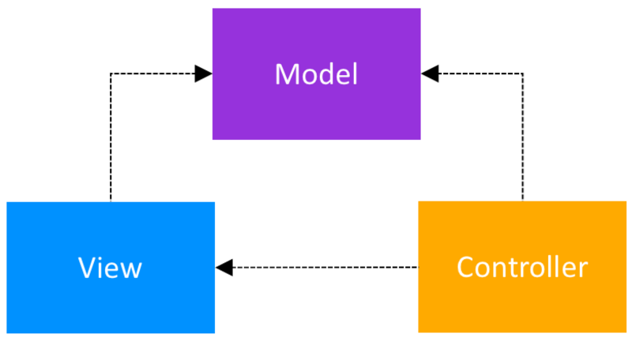
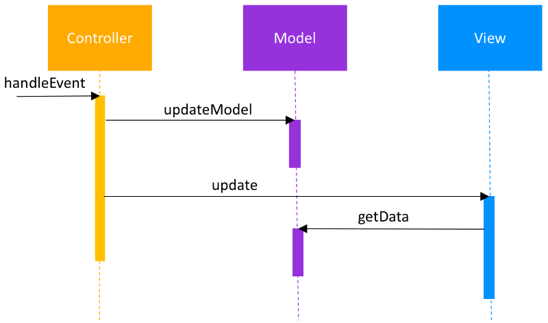
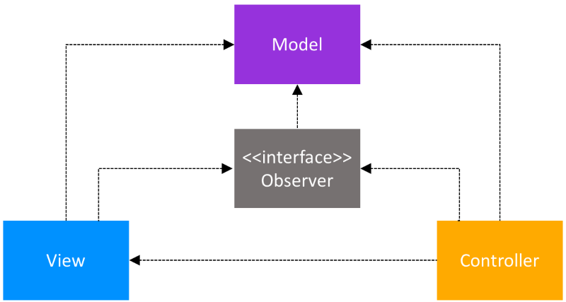
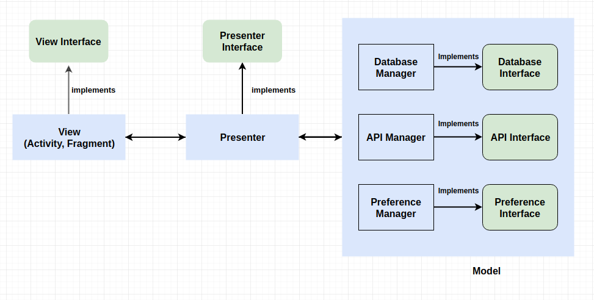
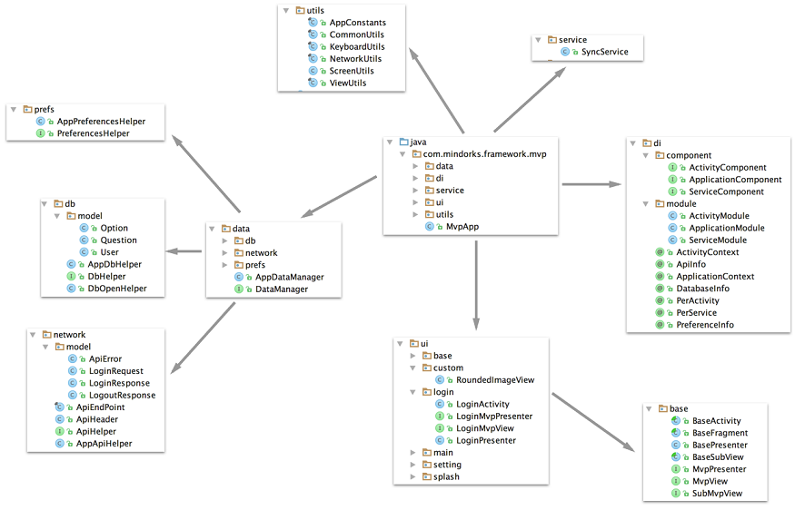

# Architecture / Compound Patterns

Android MVC, MVP, and MVVM: https://academy.realm.io/posts/eric-maxwell-mvc-mvp-and-mvvm-on-android/

## MVC

* Combines Strategy, Observer and Composite patterns

* Model — the data layer, responsible for managing the business logic and handling network or database API.
* View — the UI layer — a visualisation of the data from the Model.
* Controller — the logic layer, gets notified of the user’s behavior and updates the Model as needed.

Two types of MVC:

### Passive Model



### Active Model

For the cases when the Controller is not the only class that modifies the Model, the Model needs a way to notify the View, and other classes, about updates. This is achieved with the help of the Observer pattern. The Model contains a collection of observers that are interested in updates. The View implements the observer interface and registers as an observer to the Model.



## MVC - Android

* The Activities, Fragments and Views should be the Views
* The Controllers should be separate classes that don’t extend or use any Android class, and same for the Models.
* One problem arises when connecting the Controller to the View, since the Controller needs to tell the View to update. In the **passive Model** MVC architecture, the Controller needs to hold a reference to the View. The easiest way of doing this, while focusing on testing, is to have a BaseView interface, that the Activity/Fragment/View would extend. So, the Controller would have a reference to the BaseView.

## MVC - Web

```c
#http://x.com/users/profile/1
/routes
    users/profile/:id = Users.getProfile(id)
/controllers
    class Users{
        function getProfile(id){
            profile = this.UserModel.getProfile(id)
            renderView('users/profile', profile)
/models
    class UserModel{
        function getProfile(id){
            return this.db.get('SELECT * FROM users WHERE id='+id);
/views
    /users
        /profile
            <h1>{{profile.name}}</h1>
```

## MVP



* Model - the data layer. Responsible for handling the business logic and communication with the network and database layers.
* View - the UI layer. Displays the data and notifies the Presenter about user actions.
* Presenter - retrieves the data from the Model, applies the UI logic and manages the state of the View, decides what to display and reacts to user input notifications from the View.

## MVP - Android

* Model: The retrieval of tasks is done with the help of RxJava:

```java
public Observable<List<Task>> getTasks(){  ...
```

* ModelTest: The Model receives as parameters in the constructor interfaces of the local and remote data sources, making the Model completely independent from any Android classes and thus easy to unit test with JUnit

```java
@Mock
private TasksDataSource mTasksRemoteDataSource;
@Mock
private TasksDataSource mTasksLocalDataSource;
...
@Test
public void getTasks_requestsAllTasksFromLocalDataSource() {
    // Given that the local data source has data available
    setTasksAvailable(mTasksLocalDataSource, TASKS);
    // And the remote data source does not have any data available
    setTasksNotAvailable(mTasksRemoteDataSource);
    // When tasks are requested from the tasks repository
    TestSubscriber<List<Task>> testSubscriber = new TestSubscriber<>();
    mTasksRepository.getTasks().subscribe(testSubscriber);
    // Then tasks are loaded from the local data source
    verify(mTasksLocalDataSource).getTasks();
    testSubscriber.assertValue(TASKS);
}
```

* View: The View works with the Presenter to display the data and it notifies the Presenter about the user’s actions. All Views implement the same BaseView interface that allows setting a Presenter.

```java
public interface BaseView<T> {
    void setPresenter(T presenter);
```

The View notifies the Presenter that it is ready to be updated by calling the subscribe method of the Presenter in onResume. The View calls presenter.unsubscribe() in onPause to tell the Presenter that it is no longer interested in being updated. If the implementation of the View is an Android custom view, then the subscribe and unsubscribe methods have to be called on onAttachedToWindow and onDetachedFromWindow. User actions, like button clicks, will trigger corresponding methods in the Presenter, this being the one that decides what should happen next.

The Views are tested with Espresso. The statistics screen, for example, needs to display the number of active and completed tasks. The test that checks that this is done correctly first puts some tasks in the TaskRepository; then launches the StatisticsActivity and checks content of the views:

```java
@Before
public void setup() {
    // Given some tasks
    TasksRepository.destroyInstance();
    TasksRepository repository = Injection.provideTasksRepository(
            InstrumentationRegistry.getContext());
    repository.saveTask(new Task("Title1", "", false));
    repository.saveTask(new Task("Title2", "", true));
    // Lazily start the Activity from the ActivityTestRule
    Intent startIntent = new Intent();
    mStatisticsActivityTestRule.launchActivity(startIntent);
}
@Test
public void Tasks_ShowsNonEmptyMessage() throws Exception {
    // Check that the active and completed tasks text is displayed
    Context context = InstrumentationRegistry.getTargetContext();
    String expectedActiveTaskText = context
        .getString(R.string.statistics_active_tasks);
    onView(withText(containsString(expectedActiveTaskText)))
        .check(matches(isDisplayed()));
    String expectedCompletedTaskText = context
        .getString(R.string.statistics_completed_tasks);
    onView(withText(containsString(expectedCompletedTaskText)))
        .check(matches(isDisplayed()));
}
```

* Presenter: The Presenter and its corresponding View are created by the Activity. References to the View and to the TaskRepository - the Model - are given to the constructor of the Presenter. In the implementation of the constructor, the Presenter will call the setPresenter method of the View. This can be simplified when using a dependency injection framework that allows the injection of the Presenters in the corresponding views, reducing the coupling of the classes.

All Presenters implement the same BasePresenter interface.

```java
public interface BasePresenter {
    void subscribe();
    void unsubscribe();
```

When the subscribe method is called, the Presenter starts requesting the data from the Model, then it applies the UI logic to the received data and sets it to the View. For example, in the StatisticsPresenter, all tasks are requested from the TaskRepository - then the retrieved tasks are used to compute the number of active and completed tasks. These numbers will be used as parameters for the showStatistics(int numberOfActiveTasks, int numberOfCompletedTasks) method of the View.

A unit test to check that indeed the showStatistics method is called with the correct values is easy to implement. We are mocking the TaskRepository and the StatisticsContract.View and give the mocked objects as parameters to the constructor of a StatisticsPresenter object. The test implementation is:

```java
@Test
public void loadNonEmptyTasksFromRepository_CallViewToDisplay() {
    // Given an initialized StatisticsPresenter with
    // 1 active and 2 completed tasks
    setTasksAvailable(TASKS);
    // When loading of Tasks is requested
    mStatisticsPresenter.subscribe();
    // Then the correct data is passed on to the view
    verify(mStatisticsView).showStatistics(1, 2);
}
```

The role of the unsubscribe method is to clear all the subscriptions of the Presenter, thus avoiding memory leaks.

Apart from subscribe and unsubscribe, each Presenter exposes other methods, corresponding to the user actions in the View. For example, the AddEditTaskPresenter, adds methods like createTask, that would be called when the user presses the button that creates a new task. This ensures that all the user actions - and consequently all the UI logic - go through the Presenter and thereby can be unit tested.

### Disadvantages

Forgetting that the presenter is attached to the view forever:

* We can leak the activity with long-running tasks
    > If you can ensure that your background tasks finish in a reasonable amount of time, I wouldn’t worry much. Leaking an activity 5-10 seconds won’t make your App much worse, and the solutions to this are usually complex.
* We can try to update activities that have already died
    > To solve this, we call `unsubscribe` in RxJava or the onDestroy() method that cleans the view: `fun onDestroy() {loginView = null}`



## MVVM

* The View - that informs the ViewModel about the user’s actions
* The ViewModel - exposes streams of data relevant to the View
* The DataModel - abstracts the data source. The ViewModel works with the DataModel to get and save the data.


At a first glance, MVVM seems very similar to the MVP pattern, because both of them do a great job in abstracting the view’s state and behavior. The Presentation Model abstracts a View independent from a specific user-interface platform, whereas the MVVM pattern was created to simplify the event driven programming of user interfaces.

## MVVM - Android

**DataModel**
The DataModel exposes data easily consumable through event streams - RxJava’s Observables. It composes data from multiple sources, like the network layer, database or shared preferences and exposes easily consumable data to whomever needs it. The DataModels hold the entire business logic.

Our strong emphasis on the single responsibility principle leads to creating a DataModel for every feature in the app. For example, we have an ArticleDataModel that composes its output from the API service and database layer. This DataModel handles the business logic ensuring that the latest news from the database is retrieved, by applying an age filter.

**ViewModel**
The ViewModel is a model for the View of the app: an abstraction of the View. The ViewModel retrieves the necessary data from the DataModel, applies the UI logic and then exposes relevant data for the View to consume. Similar to the DataModel, the ViewModel exposes the data via Observables.

We learned two things about the ViewModel the hard way:

The ViewModel should expose states for the View, rather than just events. For example, if we need to display the name and the email address of a User, rather than creating two streams for this, we create a DisplayableUser object that encapsulates the two fields. The stream will emit every time the display name or the email changes. This way, we ensure that our View always displays the current state of the User.

We should make sure that every action of the user goes through the ViewModel and that any possible logic of the View is moved in the ViewModel.

We wrote about these two topics in a blog post about common mistakes in MVVM + RxJava.

**View**
The View is the actual user interface in the app. It can be an Activity, a Fragment or any custom Android View. For Activities and Fragments, we are binding and unbinding from the event sources on onResume() and onPause().

```java
    private final CompositeSubscription mSubscription = new CompositeSubscription();

    @Override
    public void onResume() {
        super.onResume();
        mSubscription.add(mViewModel.getSomeData()
                         .observeOn(AndroidSchedulers.mainThread())
                         .subscribe(this::updateView,
                                    this::handleError));
    }

    @Override
    public void onPause() {
        mSubscription.clear();
        super.onPause();
    }
```

If the MVVM View is a custom Android View, the binding is done in the constructor. To ensure that the subscription is not preserved, leading to possible memory leaks, the unbinding happens in onDetachedFromWindow.

```java
    private final CompositeSubscription mSubscription = new CompositeSubscription();

    public MyView(Context context, MyViewModel viewModel) {
        ...
        mSubscription.add(mViewModel.getSomeData()
                         .observeOn(AndroidSchedulers.mainThread())
                         .subscribe(this::updateView,
                                    this::handleError));
    }

    @Override
    public void onDetachedFromWindow() {
        mSubscription.clear();
        super.onDetachedFromWindow();
    }
}
```

Testability Of The Model-View-ViewModel Classes

* DataModel:
The use of inversion of control pattern, heavily applied in our code, and the lack of any Android classes, facilitate the implementation of unit tests of the DataModel.

* ViewModel:
We see the Views and the unit tests as two different types of consumers of data from the ViewModel. The ViewModel is completely separated from the UI or any Android classes, therefore straightforward to unit test.

Consider the following example where the ViewModel just exposes some data from the DataModel:

```java
public class ViewModel {
    private final IDataModel mDataModel;

    public ViewModel(IDataModel dataModel) {
        mDataModel = dataModel;
    }

    public Observable<Data> getSomeData() {
        return mDataModel.getSomeData();
    }
}
```

The tests for the ViewModel are easy to implement. With the help of Mockito, we are mocking the DataModel and we control the returned data for the methods used. Then, we make sure that when we subscribe to the Observable returned by getSomeData(), the expected data is emitted.

```java
public class ViewModelTest {

    @Mock
    private IDataModel mDataModel;

    private ViewModel mViewModel;

    @Before
    public void setUp() throws Exception {
        MockitoAnnotations.initMocks(this);

        mViewModel = new ViewModel(mDataModel);
    }

    @Test
    public void testGetSomeData_emitsCorrectData() {
        SomeData data = new SomeData();
        Mockito.when(mDataModel.getSomeData()).thenReturn(Observable.just(data));
        TestSubscriber<SomeData> testSubscriber = new TestSubscriber<>();

        mViewModel.getSomeData().subscribe(testSubscriber);

        testSubscriber.assertValue(data);
    }
}
```

If the ViewModel needs access to Android classes, we create wrappers that we call Providers. For example, for Android resources we created a IResourceProvider, that exposes methods like String getString(@StringRes final int id). The implementation of the IResourceProvider will contain a reference to the Context but, the ViewModel will only refer to an IResourceProvider injected.

* Sample https://academy.realm.io/posts/eric-maxwell-mvc-mvp-and-mvvm-on-android/


```java
public class TicTacToeViewModel implements ViewModel {

    private Board model;

    /* 
     * These are observable variables that the viewModel will update as appropriate
     * The view components are bound directly to these objects and react to changes
     * immediately, without the ViewModel needing to tell it to do so. They don't
     * have to be public, they could be private with a public getter method too.
     */
    public final ObservableArrayMap<String, String> cells = new ObservableArrayMap<>();
    public final ObservableField<String> winner = new ObservableField<>();

    public TicTacToeViewModel() {
        model = new Board();
    }

    // As with presenter, we implement standard lifecycle methods from the view
    // in case we need to do anything with our model during those events.
    public void onCreate() { }
    public void onPause() { }
    public void onResume() { }
    public void onDestroy() { }

    /**
     * An Action, callable by the view.  This action will pass a message to the model
     * for the cell clicked and then update the observable fields with the current
     * model state.
     */
    public void onClickedCellAt(int row, int col) {
        Player playerThatMoved = model.mark(row, col);
        cells.put("" + row + col, playerThatMoved == null ? 
                                                     null : playerThatMoved.toString());
        winner.set(model.getWinner() == null ? null : model.getWinner().toString());
    }

    /**
     * An Action, callable by the view.  This action will pass a message to the model
     * to restart and then clear the observable data in this ViewModel.
     */
    public void onResetSelected() {
        model.restart();
        winner.set(null);
        cells.clear();
    }
}
```

```xml
<!-- 
    With Data Binding, the root element is <layout>.  It contains 2 things.
    1. <data> - We define variables to which we wish to use in our binding expressions and 
                import any other classes we may need for reference, like android.view.View.
    2. <root layout> - This is the visual root layout of our view.  This is the root xml tag in the MVC and MVP view examples.
-->
<layout xmlns:android="http://schemas.android.com/apk/res/android"
    xmlns:tools="http://schemas.android.com/tools"
    xmlns:app="http://schemas.android.com/apk/res-auto">

    <!-- We will reference the TicTacToeViewModel by the name viewModel as we have defined it here. -->
    <data>
        <import type="android.view.View" />
        <variable name="viewModel" type="com.acme.tictactoe.viewmodel.TicTacToeViewModel" />
    </data>
    <LinearLayout...>
        <GridLayout...>
            <!-- onClick of any cell in the board, the button clicked will invoke the onClickedCellAt method with its row,col -->
            <!-- The display value comes from the ObservableArrayMap defined in the ViewModel  -->
            <Button
                style="@style/tictactoebutton"
                android:onClick="@{() -> viewModel.onClickedCellAt(0,0)}"
                android:text='@{viewModel.cells["00"]}' />
            ...
            <Button
                style="@style/tictactoebutton"
                android:onClick="@{() -> viewModel.onClickedCellAt(2,2)}"
                android:text='@{viewModel.cells["22"]}' />
        </GridLayout>

        <!-- The visibility of the winner view group is based on whether or not the winner value is null.
             Caution should be used not to add presentation logic into the view.  However, for this case
             it makes sense to just set visibility accordingly.  It would be odd for the view to render
             this section if the value for winner were empty.  -->
        <LinearLayout...
            android:visibility="@{viewModel.winner != null ? View.VISIBLE : View.GONE}"
            tools:visibility="visible">

            <!-- The value of the winner label is bound to the viewModel.winner and reacts if that value changes -->
            <TextView
                ...
                android:text="@{viewModel.winner}"
                tools:text="X" />
            ...
        </LinearLayout>
    </LinearLayout>
</layout>
```